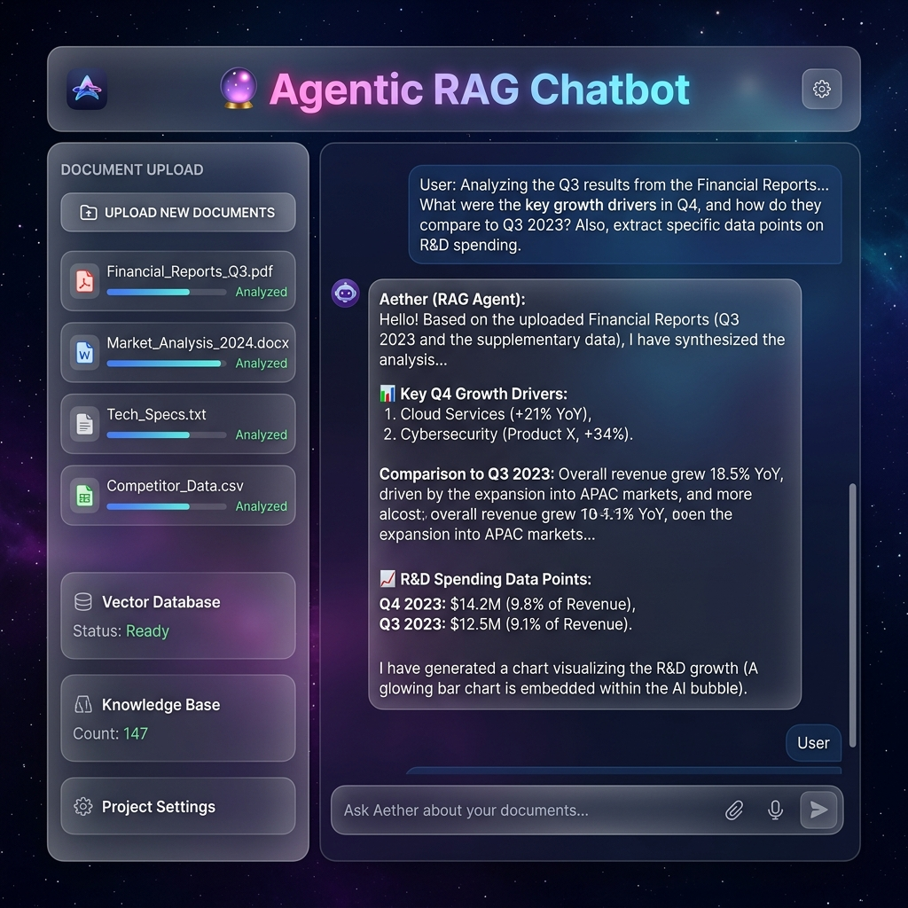

# Agentic RAG Chatbot for Multi-Format Document QA using MCP



## 📝 Overview
The **Agentic RAG Chatbot** is a high-level, multi-agent AI system designed to answer complex questions based solely on uploaded documents. Unlike standard chatbots, this system utilizes a modular "Agentic" architecture where specialized AI workers collaborate to parse data, retrieve information, and generate accurate, context-aware responses.

## ✨ Features
*   **Multi-Format Support:** Seamlessly process PDF, PPTX, DOCX, CSV, and TXT files.
*   **Agentic Orchestration:** Specialized agents for Ingestion, Retrieval, and Generation.
*   **Semantic Search:** Utilizes FAISS (Facebook AI Similarity Search) for millisecond-fast document retrieval.
*   **MCP Protocol:** Implements structured Model Context Protocol (MCP) communication for traceability.
*   **Deep Context Inspection:** View the exact source chunks used by the AI to verify accuracy.
*   **Premium UI:** Modern "Glassmorphism" interface built with Streamlit and custom CSS.

## 🛠️ Tech Stack
*   **Frontend:** Streamlit (Python-based Web Framework)
*   **LLM Engine:** Google Gemini 2.5 Flash
*   **Vector Database:** FAISS (Local CPU-based)
*   **Embeddings:** Sentence-Transformers (all-MiniLM-L6-v2)
*   **Parsing:** PyPDF2, python-pptx, python-docx, pandas
*   **Environment:** Python 3.9+, python-dotenv

## 🏗️ Architecture & MCP
This project follows a **Multi-Agent Orchestration** pattern. Every action in the system is handled by a specialized agent communicating via structured JSON messages based on the **Model Context Protocol (MCP)**.

### The Agents:
1.  **CoordinatorAgent:** The "Brain" that orchestrates the entire workflow and manages message routing.
2.  **IngestionAgent:** Handles raw file bytes and extracts clean, chunked text.
3.  **RetrievalAgent:** Converts text into vector embeddings and searches the FAISS index.
4.  **LLMResponseAgent:** Takes retrieved context and crafts the final human-like response.

### MCP Message Structure:
Agents communicate using a standardized format:
```json
{
  "sender": "CoordinatorAgent",
  "receiver": "RetrievalAgent",
  "type": "RETRIEVE_CONTEXT",
  "trace_id": "9be75902...",
  "payload": { "query": "Your question", "top_k": 3 }
}
```

## 🔄 Workflow
1.  **Ingestion:** User uploads a document. The Coordinator sends it to the **IngestionAgent** for text extraction.
2.  **Indexing:** Extracted text is sent to the **RetrievalAgent**, which generates embeddings and saves them in the FAISS database.
3.  **Querying:** When a user asks a question, the Coordinator triggers the **RetrievalAgent** to find relevant paragraphs.
4.  **Generation:** The retrieved paragraphs are sent to the **LLMResponseAgent**, which uses Gemini 2.5 to answer the question using *only* that context.

## 📂 Project Structure
```text
Chatbot/
├── .streamlit/          # Theme & UI Configuration
├── agents/              # AI Agent Logic (Coordinator, Ingestion, etc.)
├── test_data/           # Sample PDF/PPTX/CSV files for testing
├── utils/               # Document parsing utilities
├── vector_store/        # FAISS vector database implementation
├── app.py               # Main Streamlit Application
├── .env                 # API Keys (Local Only)
├── .gitignore           # Prevents uploading secret keys
├── README.md            # Project Documentation
└── requirements.txt     # Project Dependencies
```

## 🚀 How to Run
1.  **Clone the Repository:**
    ```bash
    git clone https://github.com/Monu034/agentic-rag-chatbot.git
    cd agentic-rag-chatbot
    ```
2.  **Install Dependencies:**
    ```bash
    pip install -r requirements.txt
    ```
3.  **Set Up API Key:**
    Create a `.env` file in the root directory and add your Google Gemini API Key:
    ```text
    GEMINI_API_KEY=your_api_key_here
    ```
4.  **Run the App:**
    ```bash
    python -m streamlit run app.py
    ```

## 💡 Example Usage
**User:** "What are the core features of the Capstone project mentioned in the slides?"  
**Assistant:** "Based on the Batch-18 presentation, the core features include Multi-Agent communication via MCP, local FAISS vector storage, and support for multi-format document ingestion."

## ⚠️ Challenges Faced & Solutions
During the development of this project, several technical challenges were encountered and successfully resolved:

1. **Large Dataset Processing (Performance Bottleneck):**
   * *Challenge:* Processing massive 20MB+ CSV files (50,000+ rows) caused severe UI freezing and extreme processing times during the vector embedding phase.
   * *Solution:* Implemented data optimization mechanisms to efficiently parse large files by limiting row counts to maintain performance and converting data into lightweight pipe-separated formats, reducing ingestion time from minutes to seconds.
2. **Contextual Rigidity (The "I Cannot Answer This" Loop):**
   * *Challenge:* The LLM was initially too rigid and restrictive, refusing to answer questions if the exact verbatim keywords weren't present in the top 3 retrieved chunks.
   * *Solution:* Increased the FAISS vector retrieval depth (`top_k`) from 3 to 5 chunks to provide deeper context, and engineered a new "Intelligence Analyst" prompt to allow the AI to intelligently interpolate data and provide helpful partial answers.
3. **UI Synchronization with Agentic Flow:**
   * *Challenge:* Keeping the frontend Streamlit UI visually synced with the heavy backend agent processing without confusing the user.
   * *Solution:* Designed custom interactive status widgets and dynamic metric indicators (e.g., Vector Database: ACTIVE) to give users real-time feedback while the CoordinatorAgent managed MCP message routing.

## 🔮 Future Improvements
*   **Memory Management:** Add long-term memory for multi-turn conversations.
*   **OCR Integration:** Add Tesseract or PaddleOCR to read scanned images and non-digital PDFs.
*   **Hybrid Search:** Combine semantic vector search with keyword-based BM25 search for better accuracy.

## 🏁 Conclusion
This project demonstrates the power of **Agentic AI** in solving real-world data retrieval problems. By utilizing MCP and a multi-agent structure, it provides a scalable, traceable, and highly accurate solution for document-based intelligence.
